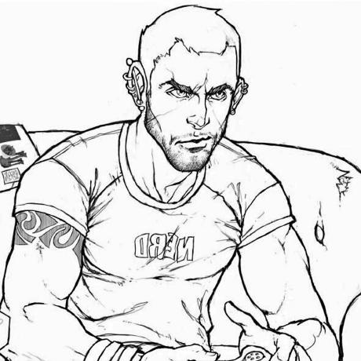
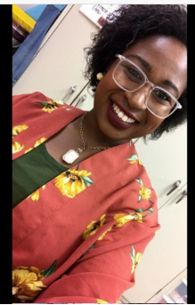
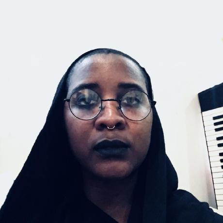

# African Marketplace 2019

## Project Description

Sauti Africa empowers small business owners, particularly women, to improve their business and economic opportunitites to grow out of poverty. You will build a platform to enable these business owners to create listing for items they have for sale.

## MVP
A small business owner can log on and see relevant prices in various categories to help them set their own prices. They can also make listing for what they want to sell, which will show up to all users.They can add a new item by selecting their market location, and then typing in their item name, description, and price.

## Documentation

The main stacks that were used to complete this project was HTML/CSS & React JS.

At the same time, we also decided to sprinkle in a few other things into the project to help make everything a bit more organized. The extra sprinkles that we used were: LESS, etc, etc.

## Product Tools

* [Product Canvas](https://docs.google.com/document/d/10mKp4c2FSLZluwIlOHZR2EBVXgbrOc056xeXmHfjAZI/edit?pli=1#)
* [Trello Board](https://trello.com/b/NZg274qQ/bw-african-marketplace)
* [Build Sprint: Culture Document](https://www.notion.so/Part-Time-Build-Sprint-Culture-Document-e344d84c5f4445709e995ed57b28c24e)

## Team Members

The team consists of seven highly motivated and skilled learners each with different sets of skills that they contributed to the completion of this project.

  

  Project Team Lead: [Leigh Taylor Martin](https://github.com/LTM888)

  
  
  User Interface Developer &amp; Ux Designer: [Jay Lee](https://github.com/dreampoetlee)

  
  
  User Interface Developer &amp; UX Designer: [Leisha Banks](https://github.com/banksleisha)

  
  
  Unit 2 Front-End Framework Developer: [Aleesha Wood](https://github.com/aleeshaw)

  
  
  Unit 2 Front-End Framework Developer: [Eva Gurtovaia](https://github.com/EvaGurtovaia)

  
  
  Unit 3 Front-End Framework Developer: [Jacqueline L Omollo](https://github.com/JacquelineOmollo)

  
  
  Unit 3 Front-End Framework Developer: [Michael Jeter](https://github.com/mikejeter)

